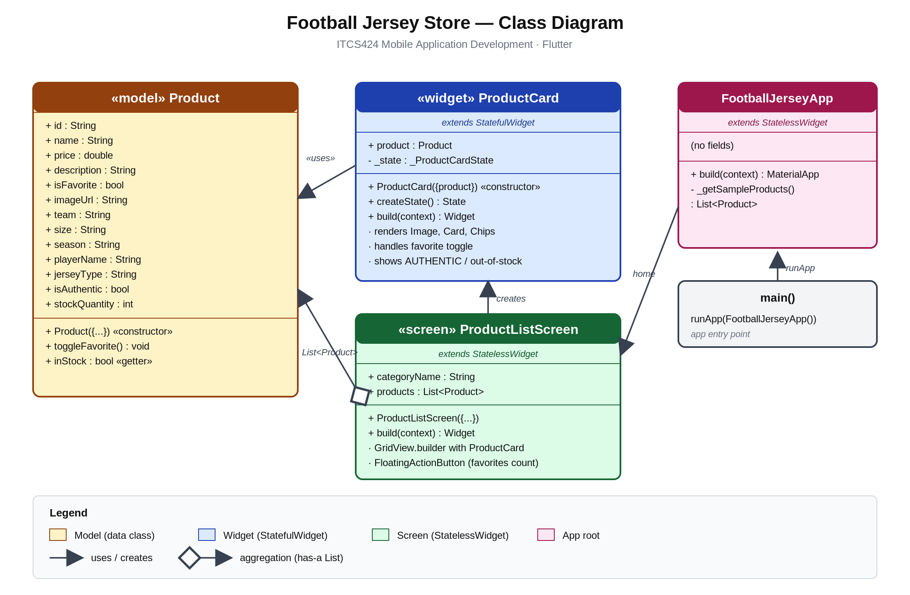

# ⚽ Football Jersey Store

> Mobile application for browsing football jerseys — built with **Flutter**.

🎓 **Course:** ITCS424 Mobile Application Development (Extra Assignment, Semester 2/2024)
🏫 **Faculty of ICT, Mahidol University**
👨‍🏫 **Advisor:** Dr. Siripen Pongpaichet
👨‍💻 **Student:** Kunach Samutvanit (6488188)

---

## 📺 Demo Video
🎥 **YouTube (Unlisted):** https://youtu.be/YOUR_VIDEO_ID

---

## 🚀 Features

- 🏠 Grid view of football jerseys (Manchester United, Real Madrid, Barcelona, Liverpool, Bayern Munich, PSG)
- ❤️ Toggle favorite (heart icon)
- 🏷️ AUTHENTIC badge for original jerseys
- 📦 Out-of-stock overlay when stock = 0
- 🎽 Player name chip + jersey type (Home / Away / Third) + season chip
- 💰 Price display in USD
- 🧮 Floating Action Button — counts favorites

---

## 🛠️ Tech Stack

| Layer | Technology |
|-------|-----------|
| Language | Dart |
| Framework | Flutter |
| Platform | Web / iOS / Android |
| IDE | VS Code |

---

## 🏗️ Architecture

```
lib/
├── main.dart                       ← App entry point + sample data
├── models/
│   └── product.dart                ← Product class (data model)
├── widgets/
│   └── product_card.dart           ← Reusable card UI (StatefulWidget)
└── screens/
    └── product_list_screen.dart    ← Main grid screen (StatelessWidget)
```

### 🎯 Class Diagram


**Relationships:**
- `FootballJerseyApp` → uses → `ProductListScreen` (as home)
- `ProductListScreen` → has-a → `List<Product>` (aggregation)
- `ProductListScreen` → creates → `ProductCard` (in builder)
- `ProductCard` → uses → `Product` (display data, toggle favorite)

---

## ⚙️ Installation & Run

### Prerequisites
- Flutter SDK installed (`flutter doctor` shows ✓ Flutter, ✓ Chrome)
- Google Chrome
- VS Code with Flutter & Dart extensions

### Steps
```bash
# 1. Clone
git clone https://github.com/YOUR_USERNAME/football-jersey-store-itcs424.git
cd football-jersey-store-itcs424

# 2. Get packages
flutter pub get

# 3. Run on Chrome
flutter run -d chrome
```

App opens in Chrome — wait 1–3 minutes for first build.

---

## 📸 Screenshots

| Home (Grid) | Favorites | Out of Stock |
|---|---|---|
| (insert) | (insert) | (insert) |

---

## 🧠 Key Concepts Demonstrated

| Concept | Where in Code |
|---|---|
| **StatelessWidget** | `ProductListScreen`, `FootballJerseyApp` |
| **StatefulWidget** | `ProductCard` (heart toggle uses `setState`) |
| **Custom Class (Model)** | `Product` |
| **GridView.builder** | `product_list_screen.dart` |
| **Network Image with errorBuilder** | `product_card.dart` |
| **Conditional Widget rendering** | AUTHENTIC badge, sold-out overlay |
| **Navigation / Dialog** | `showDialog` in FAB onPressed |
| **List filtering** | `products.where((p) => p.isFavorite)` |

---

## 📅 Submission Info

- **Email:** siripen.pon@mahidol.ac.th
- **Subject:** ITCS424 Assignment - 6488188 Kunach
- **Attached:** `docs/model_diagram.png`
- **Links sent:** GitHub repo + Demo video
- **Collaborator added:** `siripenp`
- **Oral Exam:** Thursday/Friday next week — Room IT123 (TBD)

---

## 📄 License
MIT — for educational purposes (ITCS424).
